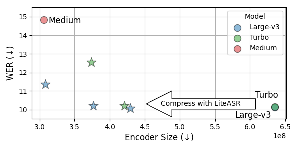
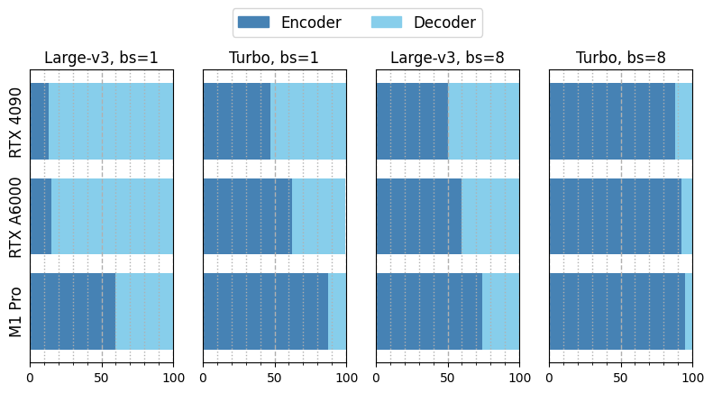
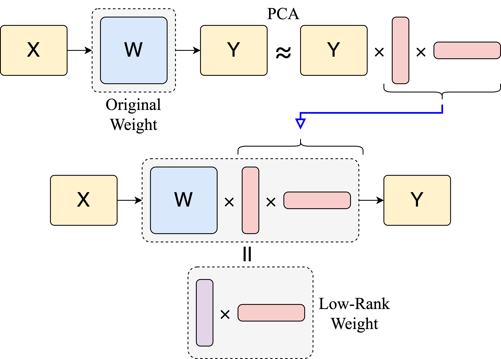

# LiteASR: Efficient Automatic Speech Recognition with Low-Rank Approximation
[](https://arxiv.org/abs/2502.XXXXX)
[](https://huggingface.co/efficient-speech/lite-whisper-large-v3-turbo)
[](https://huggingface.co/efficient-speech/lite-whisper-large-v3)

LiteASR is a compression scheme for automatic speech recognition (ASR) models that leverages the _low-rank_ properties of activation values. Our method can compress OpenAI's Whisper encoder by up to **~50%**.

This repository contains the code for compressing the models and running inference. For technical details, take a look at our [preprint]().



## Abstract 

Modern automatic speech recognition (ASR) models, such as OpenAI’s Whisper, rely on deep encoder-decoder architectures, and their encoders are a critical bottleneck for efficient deployment due to high computational intensity. We introduce **LiteASR**, a low-rank compression scheme for ASR encoders that significantly reduces inference costs while maintaining transcription accuracy. Our approach leverages the strong low-rank properties observed in intermediate activations: by applying principal component analysis (PCA) with a small calibration dataset, we approximate linear transformations with a chain of low-rank matrix multiplications, and further optimize self-attention to work in the reduced dimension. Evaluation results show that our method can compress Whisper large-v3’s encoder size by over 50%, matching Whisper medium’s size with better transcription accuracy, thereby establishing a new Pareto-optimal frontier of efficiency and performance.

## Quick Start

The easiest way to run our model is to use our integration with HuggingFace Transformers library.
We provide model weights for the compressed version of OpenAI Whisper series [here](https://huggingface.co/efficient-speech).

```python
import librosa 
import torch
from transformers import AutoProcessor, AutoModel

device = "cuda:0"
dtype = torch.float16

# load the compressed Whisper model
model = AutoModel.from_pretrained(
    "efficient-speech/lite-whisper-large-v3-turbo", 
    trust_remote_code=True, 
)
model.to(dtype).to(device)

# we use the same processor as the original model
processor = AutoProcessor.from_pretrained("openai/whisper-large-v3")

# set the path to your audio file
path = "path/to/audio.wav"
audio, _ = librosa.load(path, sr=16000)

input_features = processor(audio, sampling_rate=16000, return_tensors="pt").input_features
input_features = input_features.to(dtype).to(device)

predicted_ids = model.generate(input_features)
transcription = processor.batch_decode(
    predicted_ids, 
    skip_special_tokens=True
)[0]

print(transcription)
```

We also provide more optimized inference code under [`src/`](./src/) directory, including our custom Triton kernel.

```bash
python src/run.py --model efficient-speech/lite-whisper-large-v3-turbo --audio-path <path-to-audio> 
```

For inference on MacBook, we have MLX implementation under [`src/mlx/`](./src/mlx/).

```bash
python src/mlx/run.py --model efficient-speech/lite-whisper-large-v3-turbo --audio-path <path-to-audio> 
```

## Compression 

To compress the model by yourself, use [`src/compress.py`](./src/compile.py). Example:

```bash
python src/compress.py --base_model turbo --low_rank --rank_threshold 0.99:0.999 --save_weight
```

You can tweak `--rank_threshold` argument to explore the balance the size and accuracy trade-off.

## Motivations and Methodology

State-of-the-art ASR models typically employ encoder-decoder architectures, with LiteASR focusing specifically on compressing the encoder part. The encoder has emerged as the primary runtime bottleneck for two key reasons:

1. Recent works like [Whisper-Turbo](https://huggingface.co/openai/whisper-large-v3-turbo) and [Distill-Whisper](https://huggingface.co/distil-whisper/distil-large-v3) demonstrate that the decoder can be aggressively compressed (8x or 16x) through distillation techniques with minimal impact on accuracy.

2. Unlike decoders (which are primarily _memory-bound_), encoders must process longer sequences (e.g., 1500 tokens for Whisper) and are _compute-bound_, resulting in limited [batching efficiency](https://le.qun.ch/en/blog/2023/05/13/transformer-batching/) when handling multiple concurrent requests.

The figure below illustrates latency breakdown across various hardware configurations, model architectures, and batch sizes. As batch sizes increase and more recent models (i.e., turbo) are used, the encoder's proportion of overall latency grows substantially. This effect is particularly pronounced on devices with less computational power, such as the M1 Pro MacBook, compared to NVIDIA GPUs.



Compounding these challenges, Whisper models require fixed-length inputs (30 seconds = 1500 tokens) for encoders, creating inefficiencies when processing short audio clips or building [streaming applications](https://github.com/ufal/whisper_streaming). Weight quantization techniques, while effective at reducing model size, cannot accelerate the compute-bound encoders.

LiteASR addresses these limitations by fundamentally reducing the computational requirements of ASR encoders. Our approach is based on a key insight: we observed consistent low-rank structures in activation values during inference across diverse inputs. This property enables us to approximate activation values as products of low-rank matrices, which in turn allows us to represent weight matrices as chains of computationally efficient low-rank matrix multiplications.

The simplified visualization below illustrates our core concept. For a more comprehensive technical explanation, please refer to our [paper]().



## Benchmark Results

LiteASR can compress Whisper models with minimal degradation in accuracy (`lite-whisper` series). 
We provide three checkpoints per model: fast, plain, and acc, to be chosen based on resource and accuracy requirements.
Here is the average word error rate (WER) evaluated on the [ESB datasets](https://huggingface.co/datasets/hf-audio/esb-datasets-test-only-sorted):

| Model | Average WER (↓) | Encoder Size | Decoder Size |
|-------|----------------|--------------|--------------|
| [whisper-large-v3](https://huggingface.co/openai/whisper-large-v3) | 10.1 | 635M | 907M |
| [lite-whisper-large-v3-acc](https://huggingface.co/efficient-speech/lite-whisper-large-v3-acc) | 10.1 | 429M | 907M |
| [lite-whisper-large-v3](https://huggingface.co/efficient-speech/lite-whisper-large-v3) | 10.2 | 377M | 907M |
| [lite-whisper-large-v3-fast](https://huggingface.co/efficient-speech/lite-whisper-large-v3-fast) | 11.3 | 308M | 907M |
| &nbsp; | &nbsp; | &nbsp; | &nbsp; |
| [whisper-large-v3-turbo](https://huggingface.co/openai/whisper-large-v3-turbo) | 10.1 | 635M | 172M |
| [lite-whisper-large-v3-turbo-acc](https://huggingface.co/efficient-speech/lite-whisper-large-v3-turbo-acc) | 10.2 | 421M | 172M |
| [lite-whisper-large-v3-turbo](https://huggingface.co/efficient-speech/lite-whisper-large-v3-turbo) | 12.6 | 374M | 172M |
| [lite-whisper-large-v3-turbo-fast](https://huggingface.co/efficient-speech/lite-whisper-large-v3-turbo-fast) | 20.1 | 313M | 172M |
| &nbsp; | &nbsp; | &nbsp; | &nbsp; |
| [whisper-medium](https://huggingface.co/openai/whisper-medium) | 14.8 | 306M | 457M |

See [our paper]() for more evaluation results.

## Acknowledgement

- [OpenAI Whisper](https://github.com/openai/whisper)
- [MLX Whisper](https://github.com/ml-explore/mlx-examples/tree/main/whisper)
- [ASR Leaderboard](https://github.com/huggingface/open_asr_leaderboard)

## Citation

If you use LiteASR in your research, please cite the following paper:

```
```
